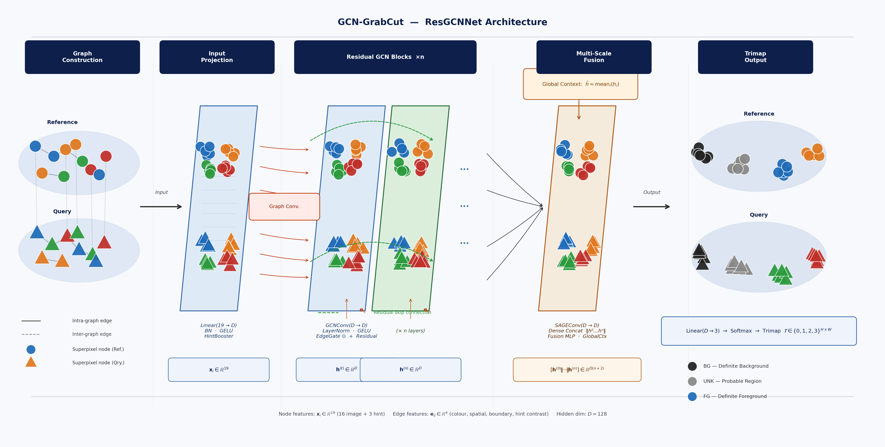

<div align="center">


# GCN-GrabCut

**Interactive image segmentation powered by Graph Convolutional Networks**

*Replace manual trimap annotation with an automatically predicted trimap — refined by GrabCut for pixel-perfect results.*

</div>

---

## Overview

Classical GrabCut requires the user to supply a **trimap** — a painstaking pixel-level annotation that labels regions as definite foreground, definite background, or unknown. **GCN-GrabCut eliminates this bottleneck.**

With a handful of clicks or rough scribbles, our GCN builds a superpixel graph of the image, propagates your sparse hints via message-passing, and predicts a high-quality trimap automatically. GrabCut then refines the result to produce a clean binary segmentation mask.

```
User clicks  →  Superpixel Graph  →  GCN Trimap Prediction  →  GrabCut Refinement  →  Segmentation Mask
```

---

## Architecture

> The diagram below shows the full **ResGCNNet** pipeline: graph construction from SLIC superpixels, residual GCN message-passing with edge-feature gating, multi-scale fusion via SAGEConv, and 3-class trimap output.




*Figure 1. End-to-end architecture of GCN-GrabCut. Nodes represent SLIC superpixels (circles = reference, triangles = query). Dashed green arrows denote residual skip connections; dotted red arrows show edge-feature injection. The Global Context module broadcasts a graph-level summary vector back to all nodes before the trimap head.*

---

## How It Works

### 1 · Graph Construction

The input image is over-segmented into **N superpixels** using SLIC. Each superpixel becomes a node in a Region Adjacency Graph (RAG), augmented with *k*-NN long-range edges.

| Feature set | Dimension | Description |
|------------|-----------|-------------|
| Colour (LAB) | 3 | Mean L\*, a\*, b\* per superpixel |
| Texture | 7 | LBP / HOG local descriptors |
| Spatial | 6 | Centroid, area, bounding box |
| **Hint** | **3** | P(FG), P(BG), P(UNK) from user input |
| **Node total** | **19** | `x_i ∈ ℝ¹⁹` |

Edge features `e_ij ∈ ℝ⁴` encode colour dissimilarity, spatial distance, boundary strength, and hint contrast between adjacent superpixels.

### 2 · GCN Trimap Prediction

Three model variants are provided, sharing a common interface:

```python
logits = model(data)          # (N, 3)  per-superpixel class logits
trimap = model.predict_trimap(data, segments)   # (H, W) uint8
```

#### `ResGCNNet` *(recommended)*
> Best for ≥ 100 training images.

- **HintBooster** — amplifies node features at hint locations before any convolution
- **Pre-norm residual blocks** — `n` layers of `GCNConv → LayerNorm → EdgeGate ⊙ → GELU → +skip`
- **SAGEConv** multi-scale branch for neighbourhood aggregation at a coarser scale
- **Global Context** — graph-mean vector gated and broadcast back to every node
- **Dense concatenation** — all intermediate representations fused before the trimap head

#### `GATTrimapNet`
> Best for images with fine-grained or textured boundaries.

Multi-head **GATv2** attention with dynamic, node-pair-specific attention scores. Edge features are passed directly into the attention kernel (`edge_dim=4`), making attention weights boundary-aware.

#### `GCNTrimapNet`
> Best for < 50 training images. Lightweight and fast.

Residual `GCNConv` stack with batch normalisation, edge injection, and a global context module. Dense skip connections across all layers feed a multi-layer classification head.

### 3 · GrabCut Refinement

The predicted trimap `T ∈ {GC_BGD, GC_PR_BGD, GC_PR_FGD, GC_FGD}` is passed directly to OpenCV's `cv2.grabCut`. The algorithm fits Gaussian Mixture Models to the definite and probable regions and iteratively refines the segmentation boundary.

---

## Model Comparison

| | `GCNTrimapNet` | `GATTrimapNet` | `ResGCNNet` |
|---|---|---|---|
| Convolution | GCNConv | GATv2Conv | GCNConv + SAGEConv |
| Attention | x | yes, multi-head | x |
| Edge features | Gate (post-conv) | Attention kernel | Gate per layer |
| Residuals | Block-level | Long-range skip | Pre-norm + dense |
| Global context | yes | yes | yes gated broadcast |
| Hint conditioning | Input proj | Input proj | HintBooster |
| Recommended for | Small datasets | Fine boundaries | General use |
| Default layers | 6 | 5 | 8 |


## Output Labels

The GCN produces **3-class** logits which are threshold-mapped to the **4-class** GrabCut label space:

| GCN class | Threshold rule | GrabCut label |
|-----------|---------------|---------------|
| FG (2) | `P(FG) ≥ θ_fg` | `GC_FGD` — definite foreground |
| BG (0) | `P(BG) ≥ θ_bg` | `GC_BGD` — definite background |
| UNK (1) | `P(FG) > P(BG)` | `GC_PR_FGD` — probable foreground |
| UNK (1) | `P(BG) ≥ P(FG)` | `GC_PR_BGD` — probable background |

Default thresholds: `θ_fg = θ_bg = 0.55`.


<div align="center">
  <sub>Built with PyTorch · PyTorch Geometric · OpenCV</sub>
</div>