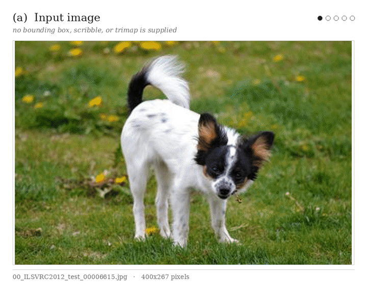
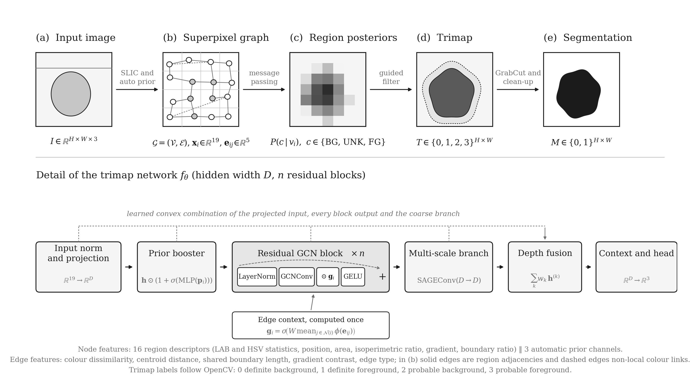
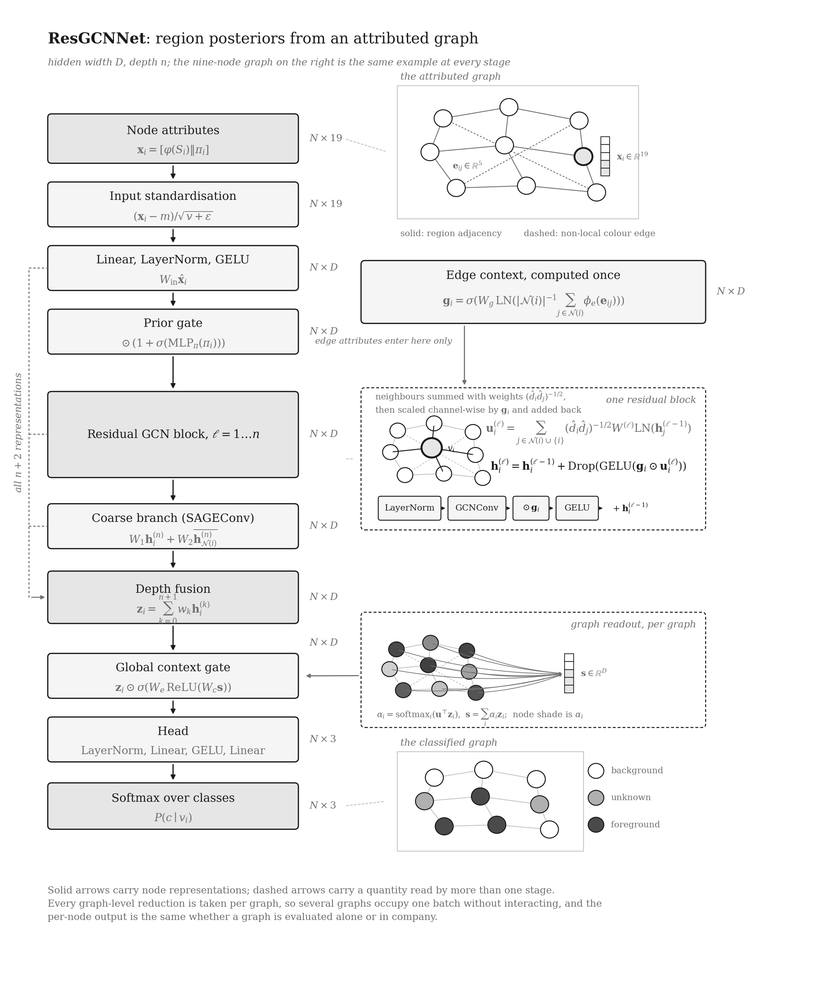

# GCN-GrabCut

**Automatic image segmentation by graph-convolutional trimap prediction and GrabCut refinement**

Haniel Ulises Vásquez Morales · Python 3.9+ · PyTorch 2.0+ · PyTorch Geometric · OpenCV · MIT licence

---

## Abstract

GrabCut (Rother et al., 2004) produces high-quality binary masks but requires a
user to supply the initialisation: a bounding box, or a trimap labelling regions
as definite foreground, definite background, or unknown. This work removes that
requirement. An image is over-segmented into superpixels and encoded as an
attributed graph whose nodes carry region descriptors together with a
training-free foreground/background prior computed from the image itself. A
residual graph convolutional network predicts a three-class posterior per region;
the posterior is projected back to pixels through a guided filter, so that label
transitions follow image edges rather than superpixel borders, and the resulting
trimap initialises GrabCut. The pipeline maps one image to one mask, with no
interaction at any stage.

---

## 1. Demonstration



**Video 1.** The pipeline applied to images of the DUTS test split that were used
neither for training nor for setting any parameter. The recording has two parts.
It opens with three images taken one stage at a time — the input, the superpixel
graph built from it, the per-region foreground posterior, the trimap obtained by
projecting those posteriors to pixels, and the mask GrabCut returns — which shows
the mechanism. It then shows a gallery of results beside the annotation each is
scored against, ordered by overlap from the best case to the worst, so the
sequence spans the held-out distribution rather than illustrating it with
favourable examples; the final frame is the weakest of sixty, where the annotation
marks a towel on the sand and the method segments the person standing behind it.
Nothing is supplied to the method beyond the image itself. The full-resolution
recording is
[`demo.mp4`](demo.mp4).

---

## 2. Problem statement

### 2.1 Notation

Let $\Omega = \{1,\dots,H\} \times \{1,\dots,W\}$ be the pixel lattice and
$I : \Omega \to \mathbb{R}^3$ an image. A segmentation is a binary map
$M : \Omega \to \{0,1\}$, with $M(p) = 1$ where $p$ belongs to the object.

The image is over-segmented into $N$ regions forming a partition

```math
\mathcal{S} = \{S_1,\dots,S_N\},\qquad
\bigcup_{i=1}^{N} S_i = \Omega,\qquad
S_i \cap S_j = \varnothing \quad (i \neq j),
```

represented by the label map $\ell : \Omega \to \{1,\dots,N\}$ with
$\ell(p) = i \iff p \in S_i$. Write $a_i = |S_i| / |\Omega|$ for the relative area
of a region, $\mu_i \in \mathbb{R}^3$ for its mean CIELAB colour and
$\bar{p}_i \in [0,1]^2$ for its centroid in normalised coordinates.

The regions are the vertices of an attributed graph
$\mathcal{G} = (\mathcal{V}, \mathcal{E})$ with $\mathcal{V} = \{v_1,\dots,v_N\}$,
node attributes $\mathbf{x}_i \in \mathbb{R}^{19}$ and edge attributes
$\mathbf{e}_{ij} \in \mathbb{R}^{5}$ for $(i,j) \in \mathcal{E}$. Let
$\mathcal{N}(i) = \{\, j : (j,i) \in \mathcal{E} \,\}$ be the neighbourhood of
$v_i$ and $\hat{d}_i = |\mathcal{N}(i)| + 1$ its degree including a self-loop.

Regions are classified into
$\mathcal{C} = \{\mathrm{bg}, \mathrm{unk}, \mathrm{fg}\}$, encoded as
$\{0,1,2\}$. The trimap $T : \Omega \to \{0,1,2,3\}$ follows the OpenCV
convention, in which $0$ and $1$ mark pixels held fixed as background and
foreground, and $2$ and $3$ mark pixels left free but initialised as probably
background and probably foreground.

### 2.2 Objective

Classical GrabCut computes $M = \mathrm{GC}(I, T)$ from a user-supplied trimap
$T$. This work replaces the user by a learned map

```math
f_\theta : \mathcal{G} \longmapsto \big( P(c \mid v_i) \big)_{i = 1 \dots N,\; c \in \mathcal{C}}
```

followed by a deterministic projection $\Pi$ from region posteriors to a pixel
trimap, so that the complete pipeline is the composition

```math
M = \mathrm{GC}\Big( I,\; \Pi\big( f_\theta(\mathcal{G}(I)),\, \ell,\, I \big) \Big),
```

in which every argument derives from $I$ alone.

---

## 3. Method



**Figure 1.** End-to-end architecture. (a) The input image is over-segmented by
SLIC. (b) Regions become graph nodes, connected by region adjacency and by
non-local edges between colour-similar regions that are not spatially adjacent.
(c) The network predicts a three-class posterior per region. (d) The posterior is
projected to pixels through a guided filter and thresholded into an OpenCV trimap.
(e) GrabCut refines the trimap into a binary mask, which is then cleaned of
spurious components.



**Figure 2.** The trimap network in isolation, with the shape of every
intermediate representation. Edge attributes enter once, through the context gate
$\mathbf{g}_i$ that every residual block reads; all $n+2$ representations reach
the fusion stage; and the attention readout is taken per graph, which is what
allows several graphs to share a batch.

### 3.1 Graph construction

Regions are obtained by SLIC (Achanta et al., 2012) in CIELAB space with a target
count $N \approx 300$–$500$. Each region carries sixteen image-derived
descriptors,

```math
\varphi(S_i) = \big[\, \mu_i^{\text{LAB}},\; \sigma_i^{\text{LAB}},\;
\mu_i^{\text{HSV}},\; \bar{p}_i,\; a_i,\; \kappa_i,\; \bar{g}_i,\;
\beta_i,\; d_i \,\big] \in \mathbb{R}^{16},
```

with $\sigma_i$ the per-channel colour standard deviation, $\kappa_i$ the
isoperimetric ratio, $\bar{g}_i$ the mean Sobel gradient magnitude, $\beta_i$ the
fraction of region pixels on its own boundary and
$d_i = \sqrt{2}\, \lVert \bar{p}_i - (\tfrac12, \tfrac12) \rVert_2$ the normalised
distance to the image centre. Concatenating the prior of Section 3.2 gives

```math
\mathbf{x}_i = \big[\, \varphi(S_i) \;\Vert\; \boldsymbol{\pi}_i \,\big]
\in \mathbb{R}^{19}, \qquad \boldsymbol{\pi}_i \in [0,1]^3 .
```

The edge set is the union of two relations. Region adjacency connects regions
sharing a pixel boundary,

```math
\mathcal{E}_{\text{adj}} = \big\{\, (i,j) : \exists\, (p,q) \in \mathcal{A}
\text{ with } \ell(p) = i,\; \ell(q) = j,\; i \neq j \,\big\},
```

where $\mathcal{A}$ is the 4- or 8-connected pixel adjacency. The count

```math
s_{ij} = \big| \big\{\, (p,q) \in \mathcal{A} :
\{\ell(p), \ell(q)\} = \{i,j\} \,\big\} \big|
```

is exactly the shared boundary length, so the edge set and that attribute are
obtained together from one pass over $\ell$. Non-local edges connect each region
to its $k = 4$ nearest neighbours in mean-colour space among regions it does not
touch,

```math
\mathcal{E}_{\text{nl}} = \big\{\, (i,j) \notin \mathcal{E}_{\text{adj}} :
\lVert \mu_i - \mu_j \rVert_2 \text{ among the } k \text{ smallest over }
m \notin \mathcal{N}_{\text{adj}}(i) \,\big\},
```

which gives message passing a path between disconnected parts of one object
without additional layers. Each edge carries

```math
\mathbf{e}_{ij} = \big[\; \lVert \mu_i - \mu_j \rVert_2,\;
\lVert \bar{p}_i - \bar{p}_j \rVert_2,\; s_{ij},\;
|\bar{g}_i - \bar{g}_j|,\;
\mathbf{1}\big[(i,j) \in \mathcal{E}_{\text{nl}}\big] \;\big] \in \mathbb{R}^{5},
```

the first three scaled to $[0,1]$ per image. The graph is stored symmetrically,
so $|\mathcal{E}| = 2\big(|\mathcal{E}_{\text{adj}}| + |\mathcal{E}_{\text{nl}}|\big)$.

Every region-level quantity above is a sum over pixels grouped by $\ell$, so all
of them are accumulated by counting passes over the label map rather than by
testing each region against it in turn — the distinction between $O(HW)$ and
$O(N \cdot HW)$ discussed in Section 4.5.

### 3.2 The automatic prior

The three components of $\boldsymbol{\pi}_i$ replace user input. They combine two
classical, training-free saliency cues. Let $\mathcal{U}[\cdot]$ denote min-max
normalisation of a vector to $[0,1]$.

**Foreground-ness.** Following the global colour contrast of Cheng et al. (2011),
a region is salient when its colour differs from the rest of the image, weighted
by region area and damped by spatial distance:

```math
c_i = \sum_{j=1}^{N} a_j \,
\exp\!\left( -\frac{\lVert \bar{p}_i - \bar{p}_j \rVert_2^2}{2\sigma_s^2} \right)
\lVert \mu_i - \mu_j \rVert_2 ,
\qquad \sigma_s = 0.40 .
```

A Gaussian centre prior modulates it,

```math
g_i = \exp\!\left( -\frac{\lVert \bar{p}_i - (\tfrac12, \tfrac12) \rVert_2^2}{2\sigma_c^2} \right),
\qquad \sigma_c = 0.45,
\qquad
\pi_i^{\mathrm{fg}} = \mathcal{U}\big[\, \mathcal{U}[c_i] \cdot g_i \,\big].
```

**Background-ness.** Following the boundary connectivity of Zhu et al. (2014),
regions touching the frame $\partial\Omega$ seed a background colour model. With
frame weights $\beta_i^{\partial} = |S_i \cap \partial\Omega| \big/ \sum_j |S_j \cap \partial\Omega|$
and frame coverage $b_i = |S_i \cap \partial\Omega| / |S_i|$,

```math
\mu_{\mathrm{bg}} = \sum_{i=1}^{N} \beta_i^{\partial} \mu_i ,
\qquad
\sigma_{\mathrm{bg}}^2 = \sum_{i=1}^{N} \beta_i^{\partial}
\big\lVert \mu_i - \mu_{\mathrm{bg}} \big\rVert_2^2 ,
```

```math
\pi_i^{\mathrm{bg}} = \mathcal{U}\!\left[\, \max\!\left(
\exp\!\left( -\frac{\lVert \mu_i - \mu_{\mathrm{bg}} \rVert_2^2}{2\sigma_{\mathrm{bg}}^2} \right),\;
\min(4 b_i,\, 1) \right) \right],
```

so that touching the frame is itself evidence of background.

**Ambiguity.** The third channel marks where the two cues disagree,

```math
\pi_i^{\mathrm{amb}} = 1 - \big| \pi_i^{\mathrm{fg}} - \pi_i^{\mathrm{bg}} \big| .
```

All three are deterministic functions of $I$, so the node attributes are fully
determined by the image: graphs are built once and reused by every training epoch.

### 3.3 Trimap network

The default model, `ResGCNNet`, maps $\mathcal{G}$ to three logits per region at
hidden width $D$ and depth $n$; Figure 2 gives the whole computation. Raw
descriptors are first standardised by running statistics $(m, v)$ accumulated over
training,

```math
\hat{\mathbf{x}}_i = \frac{\mathbf{x}_i - m}{\sqrt{v + \epsilon}} ,
```

which removes the need to hand-scale channels of very different magnitude — area
fractions of order $10^{-3}$ against unit-range colour statistics. The projection
is then modulated by the prior,

```math
\mathbf{h}_i^{(0)} = \Big( \mathrm{GELU} \circ \mathrm{LN} \circ W_{\text{in}} \Big)
\hat{\mathbf{x}}_i \;\odot\;
\Big( \mathbf{1} + \sigma\big( \mathrm{MLP}_\pi(\boldsymbol{\pi}_i) \big) \Big),
```

so confident prior evidence is amplified before any convolution, where $\odot$ is
the Hadamard product and $\sigma$ the logistic function.

**Edge context.** Edge attributes do not change with depth, so they are encoded
once into a per-node multiplicative gate

```math
\mathbf{g}_i = \sigma\!\left( W_g \, \mathrm{LN}\!\left(
\frac{1}{|\mathcal{N}(i)|} \sum_{j \in \mathcal{N}(i)} \phi_e(\mathbf{e}_{ij})
\right) \right) \in (0,1)^D
```

that every block reads. Re-projecting and re-scattering edges inside each block
would repeat identical work and add $n$ edge MLPs to the parameter count.

**Residual blocks.** For $\ell = 1, \dots, n$,

```math
\mathbf{u}_i^{(\ell)} = \sum_{j \in \mathcal{N}(i) \cup \{i\}}
\frac{1}{\sqrt{\hat{d}_i \hat{d}_j}} \; W^{(\ell)} \,
\mathrm{LN}\big( \mathbf{h}_j^{(\ell-1)} \big),
```

```math
\mathbf{h}_i^{(\ell)} = \mathbf{h}_i^{(\ell-1)} + \mathrm{Drop}\Big(
\mathrm{GELU}\big( \mathbf{g}_i \odot \mathbf{u}_i^{(\ell)} \big) \Big),
```

that is, pre-norm graph convolution (Kipf and Welling, 2017) gated by the edge
context and added back to its input.

**Coarse branch.** A SAGEConv layer (Hamilton et al., 2017) aggregates at a wider
scale,

```math
\mathbf{h}_i^{(n+1)} = \mathrm{GELU}\left( \mathrm{LN}\left(
W_1 \mathbf{h}_i^{(n)} + W_2 \frac{1}{|\mathcal{N}(i)|}
\sum_{j \in \mathcal{N}(i)} \mathbf{h}_j^{(n)} \right) \right).
```

**Depth fusion.** Rather than concatenating the $n+2$ representations, they are
mixed by a learned convex combination with parameters
$\boldsymbol{\alpha} \in \mathbb{R}^{n+2}$ (Xu et al., 2018),

```math
\mathbf{w} = \mathrm{softmax}(\boldsymbol{\alpha}) \in \Delta^{n+1},
\qquad
\mathbf{z}_i = \sum_{k=0}^{n+1} w_k \, \mathbf{h}_i^{(k)} .
```

Concatenation would force the head to accept $D(n+2)$ channels, which dominates
the parameter count and grows with depth; weighted fusion keeps the head at width
$D$ for any $n$, and $\mathbf{w}$ is itself interpretable as the depth the trained
model relies on.

**Global context and head.** An attention-pooled graph summary, taken per graph so
that graphs may share a batch, gates the fused representation:

```math
\alpha_i = \frac{\exp\big( \mathbf{u}^{\top} \mathbf{z}_i \big)}
{\sum_{j=1}^{N} \exp\big( \mathbf{u}^{\top} \mathbf{z}_j \big)},
\qquad
\mathbf{s} = \sum_{i=1}^{N} \alpha_i \mathbf{z}_i ,
\qquad
\tilde{\mathbf{z}}_i = \mathbf{z}_i \odot
\sigma\big( W_e \, \mathrm{ReLU}(W_c \mathbf{s}) \big),
```

and the posterior follows from a two-layer head,

```math
P(c \mid v_i) = \mathrm{softmax}\Big( W_h \,
\mathrm{Drop}\big( \mathrm{GELU}\big( W_f \,
\mathrm{LN}(\tilde{\mathbf{z}}_i) \big) \big) \Big)_c .
```

Two alternatives share this interface. `GATTrimapNet` replaces convolution with
multi-head GATv2 attention (Brody et al., 2022), taking $\mathbf{e}_{ij}$ into the
attention kernel, which suits fine or heavily textured boundaries;
`GCNTrimapNet` is a lighter baseline with dense skip connections, for small
datasets and ablation.

### 3.4 Region-to-pixel projection

Thresholding region posteriors directly would make every trimap boundary a
superpixel boundary, and GrabCut would inherit that quantisation. Instead each
class posterior is projected to pixels through the label map,

```math
q^c(p) = P\big( c \mid v_{\ell(p)} \big), \qquad c \in \{\mathrm{bg}, \mathrm{fg}\},
```

and filtered under the grey-level image $I_g$ as guide, using the box-filter
formulation of He et al. (2010). On a window $\omega_k$ of radius $r$,

```math
A_k = \frac{\operatorname{cov}_{\omega_k}\big( I_g,\, q^c \big)}
{\operatorname{var}_{\omega_k}(I_g) + \varepsilon},
\qquad
B_k = \operatorname{mean}_{\omega_k}\big( q^c \big)
- A_k \operatorname{mean}_{\omega_k}(I_g),
```

```math
\tilde{q}^c(p) = \overline{A}(p) \, I_g(p) + \overline{B}(p),
```

where $\overline{A}, \overline{B}$ average the per-window coefficients over the
windows containing $p$. The filter is edge-preserving, so label transitions land
on the nearest genuine intensity edge before any decision is taken. Thresholds are
applied afterwards, with $\theta_{\mathrm{fg}} = \theta_{\mathrm{bg}} = \theta$:

```math
T(p) = \begin{cases}
1 \;\; \text{(definite foreground)} & \tilde{q}^{\mathrm{fg}}(p) \geq \theta_{\mathrm{fg}}, \\
0 \;\; \text{(definite background)} & \tilde{q}^{\mathrm{bg}}(p) \geq \theta_{\mathrm{bg}}
   \;\text{ and }\; \tilde{q}^{\mathrm{fg}}(p) < \theta_{\mathrm{fg}}, \\
3 \;\; \text{(probable foreground)} & \tilde{q}^{\mathrm{fg}}(p) > \tilde{q}^{\mathrm{bg}}(p)
   \;\text{ and neither threshold is met}, \\
2 \;\; \text{(probable background)} & \text{otherwise.}
\end{cases}
```

A region is declared definite only when its posterior clears $\theta$; otherwise
the more likely side is passed as a probable label, leaving GrabCut free to move
the contour inside it.

### 3.5 Refinement and clean-up

The trimap initialises the GrabCut energy over labels $M$, mixture assignments $k$
and Gaussian-mixture parameters $\Theta$,

```math
E(M, k, \Theta, I) = \sum_{p \in \Omega} D\big( M_p, k_p, \Theta, I(p) \big)
\; + \; \gamma \sum_{(p,q) \in \mathcal{A}}
\mathbf{1}\big[ M_p \neq M_q \big] \,
\exp\!\big( -\varsigma \lVert I(p) - I(q) \rVert_2^2 \big),
```

minimised by alternating mixture re-estimation with a graph min-cut, where $D$ is
the negative log-likelihood of a pixel under its class mixture. Definite pixels
are clamped; probable pixels are free.

Two safeguards close the loop a user would otherwise close. If the predicted
trimap is one-sided — $T(\Omega)$ containing no foreground or no background label —
the min-cut is undefined, and the $\lceil 0.1 N \rceil$ regions with the highest
prior score on the missing side are promoted to the probable label of that side,

```math
T(S_i) \leftarrow 3 \quad \text{for the } \lceil 0.1 N \rceil
\text{ regions of largest } \pi_i^{\mathrm{fg}} .
```

Afterwards, connected components of $M$ covering less than a fraction $a_{\min}$
of the image are removed, and the output may be restricted to the largest
component when the image is known to contain one object.

---

## 4. Training

### 4.1 Supervision

Region labels are derived from a binary ground-truth mask $F \subseteq \Omega$
through the coverage ratio

```math
\rho_i = \frac{|S_i \cap F|}{|S_i|} \in [0,1],
\qquad
y_i = \begin{cases}
\mathrm{fg}  & \rho_i \geq \tau, \\
\mathrm{bg}  & \rho_i \leq 1 - \tau, \\
\mathrm{unk} & \text{otherwise,}
\end{cases}
\qquad \tau = 0.70 .
```

Labelling mixed regions *unknown* is the correct target rather than a compromise:
those are precisely the regions GrabCut is expected to resolve at pixel level.

### 4.2 Objective

Training on regions while evaluating on pixels introduces a mismatch — a large
region and a sliver contribute equally to a region-level loss, though they cost
very different amounts of overlap. Two terms remove it. Write
$p_{i,c} = P(c \mid v_i)$ and normalise the area weights to unit mean,

```math
\omega_i = \frac{N a_i}{\sum_{j=1}^{N} a_j} .
```

The classification term is an area-weighted focal cross-entropy (Lin et al., 2017)
with class weights $\lambda_c$,

```math
\mathcal{L}_{\text{cls}} = \frac{1}{N} \sum_{i=1}^{N} \omega_i
\big( 1 - p_{i, y_i} \big)^{\gamma}
\big( -\lambda_{y_i} \log p_{i, y_i} \big), \qquad \gamma = 2,
```

so an error is penalised in proportion to the image area it covers. The overlap
term is a soft Dice score on the expected foreground coverage

```math
u_i = p_{i, \mathrm{fg}} + \tfrac{1}{2} p_{i, \mathrm{unk}},
```

accumulated with area weights and evaluated per image $b$ in a batch
$\mathcal{B}$:

```math
\mathcal{L}_{\text{dice}} = \frac{1}{|\mathcal{B}|} \sum_{b \in \mathcal{B}}
\left( 1 - \frac{2 \sum_{i \in b} a_i u_i \rho_i + \varepsilon}
{\sum_{i \in b} a_i u_i + \sum_{i \in b} a_i \rho_i + \varepsilon} \right).
```

Unlike cross-entropy this responds to the shape of the whole mask rather than to
independent per-region decisions, and taking $\rho_i$ rather than the thresholded
label as its target lets boundary regions contribute a graded signal. The total
objective is

```math
\mathcal{L} = \mathcal{L}_{\text{cls}} + \lambda \, \mathcal{L}_{\text{dice}},
\qquad \lambda = \tfrac{1}{2} .
```

Model selection uses
$\tfrac{1}{2}\big( \mathrm{IoU}_{\mathrm{fg}} + \mathrm{IoU}_{\mathrm{bg}} \big)$
on a validation split rather than validation loss, since the loss is dominated by
the unknown class that GrabCut resolves downstream.

### 4.3 Procedure

Graphs are built once before the first epoch — in parallel across processes and
written to a persistent cache — because they are deterministic in the image.
Preparation is a separate step from optimisation: process-level parallelism and a
live CUDA context in one interpreter is a fragile combination, and separating them
means the cache is built once and reused by every later run.

Optimisation uses AdamW with layer-wise learning-rate decay, the $\ell$-th block
receiving

```math
\eta_\ell = \eta_0 \cdot 0.8^{\,n - \ell},
```

so that early layers, on which everything downstream depends, move more slowly.
Training further uses cosine annealing with warm restarts, gradient clipping at
unit norm, and automatic mixed precision on CUDA. Batches hold several graphs at
once, which is admissible because every graph-level reduction in the model — the
attention pooling of Section 3.3 among them — is taken per graph.

### 4.4 Data

The supervision must define figure and ground. A boundary-segmentation corpus does
not: masks derived from BSDS500 segmentations assign foreground to one side of an
arbitrary region, so 32 % of them are majority-foreground and the choice of side is
not a function of the image. Trained on those labels the pipeline reaches a mask
IoU of 0.37 while predicting every pixel foreground scores 0.45, and making the
polarity consistent — foreground taken as the smaller side — does not help
(validation score 0.395 against 0.427). The prior of Section 3.2 expresses
image-derived salience, which such labels do not encode.

Reported results therefore use DUTS (Wang et al., 2017): 10,553 training and 5,019
test images, each with a binary mask of one dominant object, mean foreground
coverage 11 %.

### 4.5 Computational cost

The cost of each stage follows from an asymptotic argument rather than from tuning.
Graph construction is

```math
O(HW) \; + \; O(N^2),
```

the first term covering all region reductions, which are sums over pixels grouped
by $\ell$ and therefore obtained by counting passes over the label map, and the
second the pairwise contrast of Section 3.2 together with the non-local neighbour
search. Since $N \approx 300$–$500 \ll HW$, the pixel term dominates. Testing each
region against the label map in turn would instead cost $O(N \cdot HW)$: on a
$480 \times 320$ image with 300 regions the measured difference is 0.91 s against
0.24 s, with non-local edges included in the smaller figure.

Projection back to pixels is $O(HW)$ — indexing $\ell$, not one boolean scan per
region. On an $800 \times 600$ image with 266 regions this is 1.0 ms rather than
37.5 ms, for bit-identical output.

A forward pass costs

```math
O\big( |\mathcal{E}| D + N D^2 \big),
```

in which the edge term does not scale with depth, because the encoding of
Section 3.3 is computed once, and the head contributes $O(D^2)$ rather than
$O(n D^2)$, because fusion is by weight rather than by concatenation. At $D = 96$,
$n = 6$ the model holds 107,090 parameters against 324,579 for the concatenating
variant of the same width and depth.

Two implementation properties govern wall-clock training time. Graph construction
happens once rather than once per epoch and caches to disk: ten thousand graphs are
built in minutes and reloaded in seconds thereafter.
And because no reduction mixes nodes across graphs, several graphs share an
optimisation step — a property asserted by a test requiring identical per-node
logits whether graphs are evaluated together or separately. Batching is what makes
the epoch cost tractable: over ten thousand graphs, an epoch takes two and a half
times as long at one graph per step as at thirty-two.

### 4.6 Result

Trained on DUTS at $D = 128$, $n = 6$ — 187,826 parameters, fourteen seconds per
epoch — the model reaches a validation foreground/background IoU
of 0.683 at epoch 51, after which the validation loss rises while the training loss
keeps falling, and early stopping ends the run at epoch 81. On sixty held-out test
images, with $\theta = 0.65$, $r = 4$ and 500 regions on a 512-pixel edge, the
complete pipeline attains

```math
\overline{\mathrm{IoU}} = 0.584, \qquad
\operatorname{med}\,\mathrm{IoU} = 0.640, \qquad
\Pr\big[ \mathrm{IoU} > 0.5 \big] = 0.68, \qquad
\Pr\big[ \mathrm{IoU} > 0.7 \big] = 0.38,
```

against $\overline{\mathrm{IoU}} = 0.109$ for the trivial all-foreground
prediction.

Each stage earns its place. On the same images and settings, the region-level
decision alone gives 0.508; filtering the posteriors under the image before
thresholding gives 0.516; GrabCut refinement of the resulting trimap gives 0.533.
Inference resolution matters comparably: 500 regions on a 512-pixel edge gives
0.584 where 300 regions on a 384-pixel edge gives 0.543. Because DUTS images
contain a single dominant object, restricting the output to the largest connected
component is appropriate and worth roughly 0.015.

The fusion weights $\mathbf{w}$ are informative about depth: after training the
coarse branch carries $w_{n+1} = 0.57$ and the final residual block $w_n = 0.13$,
while the four earliest blocks together carry 0.14. The network therefore relies on
wide-context aggregation far more than on deep local propagation, consistent with
the receptive-field argument for the non-local edges of Section 3.1, and suggesting
that depth beyond six blocks would not pay for itself.

The remaining error is dominated by the posterior rather than by the refinement:
the failures in Video 1 are regions assigned to the wrong side by $f_\theta$, which
GrabCut then sharpens faithfully. Predicted foreground coverage averages 0.12
against 0.11 in the ground truth, so the method is not systematically over- or
under-segmenting.

---

## 5. Note on checkpoints

Version 0.3 changes the edge attribute dimension from four to five and replaces the
dense-concatenation head with weighted fusion, so checkpoints produced by earlier
versions cannot be loaded and must be retrained. The DUTS-trained model reported in
Section 4.6 is the one used for the demonstration above.

---

## References

Rother, C., Kolmogorov, V., Blake, A. (2004). GrabCut: interactive foreground
extraction using iterated graph cuts. *ACM SIGGRAPH*.

Achanta, R. et al. (2012). SLIC superpixels compared to state-of-the-art superpixel
methods. *IEEE TPAMI*.

Wang, L. et al. (2017). Learning to detect salient objects with image-level
supervision. *IEEE CVPR*. (DUTS dataset.)

Cheng, M.-M. et al. (2011). Global contrast based salient region detection.
*IEEE CVPR*.

Zhu, W. et al. (2014). Saliency optimization from robust background detection.
*IEEE CVPR*.

He, K., Sun, J., Tang, X. (2010). Guided image filtering. *ECCV*.

Kipf, T. N., Welling, M. (2017). Semi-supervised classification with graph
convolutional networks. *ICLR*.

Hamilton, W., Ying, Z., Leskovec, J. (2017). Inductive representation learning on
large graphs. *NeurIPS*.

Brody, S., Alon, U., Yahav, E. (2022). How attentive are graph attention networks?
*ICLR*.

Xu, K. et al. (2018). Representation learning on graphs with jumping knowledge
networks. *ICML*.

Lin, T.-Y. et al. (2017). Focal loss for dense object detection. *IEEE ICCV*.
